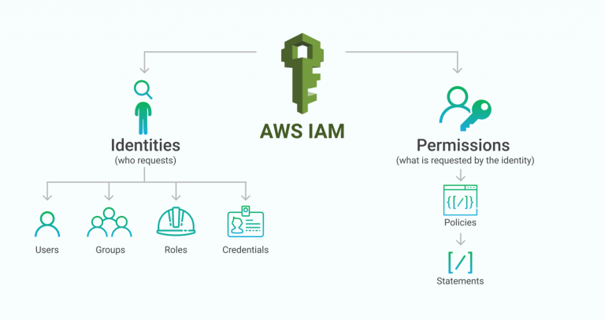
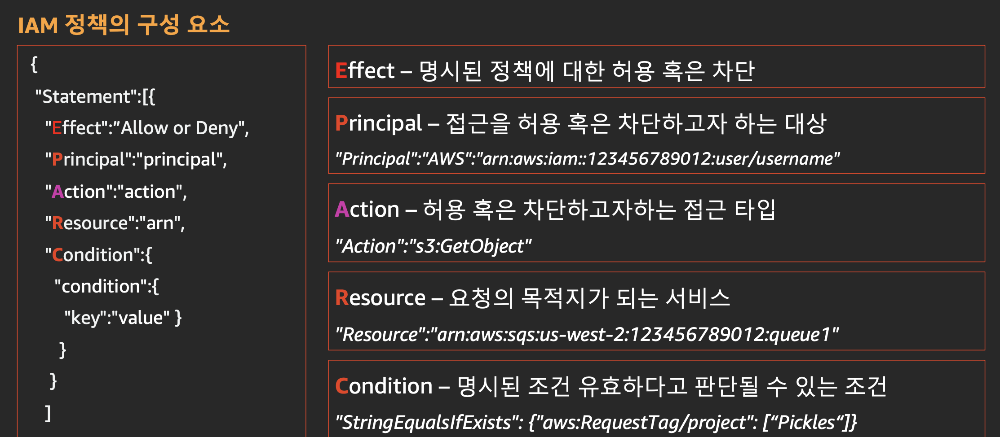
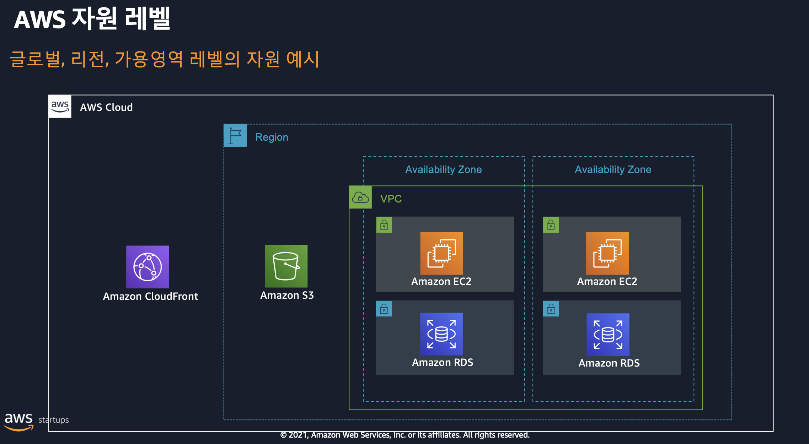
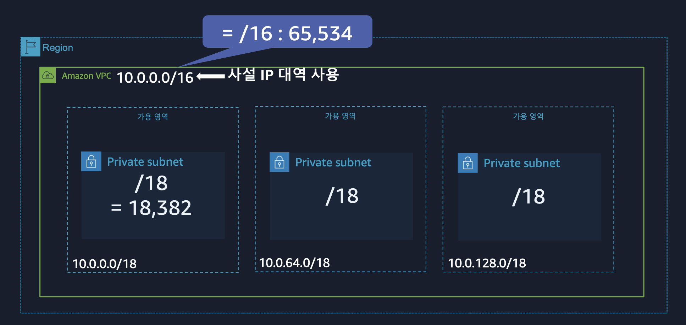
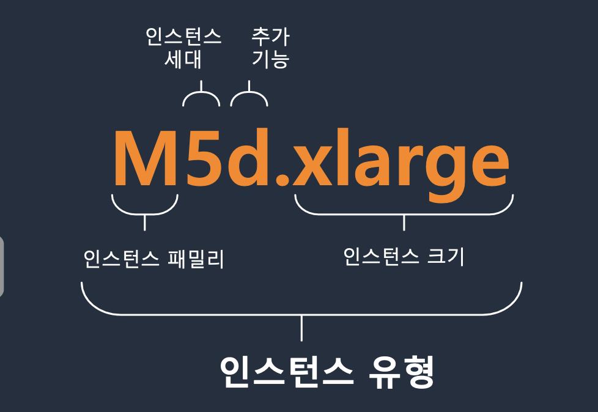
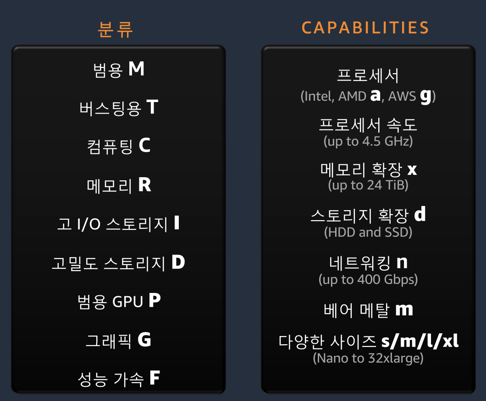
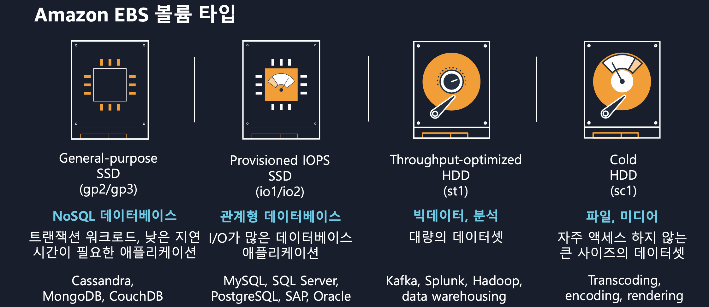

DAY1
====
aws 컴포넌트들 중 가장 기본이 되는 것들에 대해 학습하는 내용.

IAM
---
aws 전체의 권한 통제 시스템

일단 태초에 AWS account(계정)과 root user가 있다. 루트는 꼭 필요할 때만 사용하고 항상 IAM User 생성해서 사용할 것.



### 인증 🎫 : 누구인가? 
- user (group에 속할 수 있음) : 실사용자 기준. 상시적 
- group
- role : 외부 사용자, aws 서비스, 프로그램에 부여. 임시(기본 1시간)

`user` -> (name, pw, api나 cli 로그인을 위한 2 access key)  
`role` -> does not have any credentials (password or access keys) associated with it. 

### 인가 👌 : 인증된 사용자/리소스가 요청한 서비스에 대한 권한 갖고 있는가?
- policy 기준으로



**identity** 기반 vs **resource** 기반 policy로 구분할 수 있음
(예를 들자면 계정 A의 유저 a / 계정 A의 s3 리소스)

요청 성공 조건 -> IAM 보안 주체의 적법한 서명값이 포함되어 있고 (인증) AND 정책 (policy)에 의해 해당 요청이 정확하게 인가되어야 한다.

#### 최소 권한 원칙을 위한 툴 추천
- Access Advisor : 어떤 권한을 언제 마지막으로 사용했는지 확인
- Access Analyzer : aws account내의 어느 리소스에 누가 접근 가능한지 분석
- Credential Report 
- IAM Policy Simulator


Log
---
#### AWS CloudTrail
모든 aws API 요청들에 대해 신뢰성 있는 기록을 수행. (누가 언제 어디서 무엇을 결과 형태로)

90일간의 이력 조회는 무료
s3나 cloudwatch에 전달하는 서비스는 유료

#### AWS CloudWatch
aws 리소스, 앱에 대한 모니터링


VPC
---
amazon virtual private cloud. 사용자가 정의한 가상 네트워크로 aws 리소스를 시작한다.

[aws 네트워킹 기초 강의](https://www.youtube.com/watch?v=hiKPPy584Mg)  

#### 자원 레벨


#### VPC 구성하기
- 리전 >> AZ(가용 영역) >> public 서브넷, private 서브넷  

예) 서울 리전, ap-northeast-2a (public 1, private 1), ap-northeast-2c (public1, private1)

- `라우팅 테이블`  
VPC와 함께 자동으로 제공되는 라우팅 테이블. default route table이 제공되지만, 서브넷 마다 다른 routing table을 assign할 수도 있음.

- `NACL` (network access congtrol list)  
서브넷 단위로 적용되는 stateless(inbound / outbound 모두 필터링) `방화벽`. rule 번호가 낮은 우선순위로 적용된다. 
stateless의 의미 = 한방향의 트래픽을 허용했다고, 그 반대 방향의 트래픽이 허용된 것이 아님. 고로  inbound, outbound rule을 모두 명시적으로 정의해야함  
아주 **coarse-grain** 한 decision에만 사용되어야 함. NACL에 길고 복잡한 rule을 적용하지 말것.

- `Security Group`  
인스턴스 단위로 적용되는 stateful(요청 정보를 저장해 outbound 트래픽 제어는 하지 않는다.) `방화벽`   
stateful의 의미 = request가 올때 자동으로 반대 방향의 response에 대한 permission도 세팅해주므로 inbound rule만 정의하면 된다.

- `IGW`  
vpc와 인터넷 간에 통신할 수 있게 해준다. public ip를 가진 public 서브넷에 위치한 리소스인 경우 인터넷 게이트 웨이를 통해 외부 인터넷과 통신 가능.

- `NAT gateway`  
private 인스턴스도 public 서브넷에 위치한 NAT gateway를 통하면 인터넷 통신 가능.

#### vpc best practice
- 기본으로 제공되는 default vpc 대신, vpc를 새로 구성하는 것을 권장.  
- ip 대역 설정 -> 16 ~ 28 넷마스크 허용하고 있음. rfc1918에서 정의하는 사설 ip 영역대로 설정할 것.  
- 적절한 서브네팅 -> 라우팅 그룹이 커지면 라우팅에 부담이 되므로 계층적 구조로 쪼개서 관리할 것. 해당 서브넷의 용도및 몇대의 서버를 배치할 것인지 계획 후 설정하기. 
- public 서브넷에는 최소의 서버만 배치해서 인터넷 노출을 최소화 할 것.  



#### vpc 엔드포인트 타입
aws 서비스와의 연계를 위한. (같은 aws 내부의 통신일 경우 vpc 바깥에 있다고 해도 굳이 외부 인터네슬 통할 필요가 없음. 보안강화, 비용절감 차원)
- 게이트웨이 엔드포인트 : s3, 다이나모 db만 지원
- 인터페이스 엔드포인트 (private link) : 그 이외

#### vpc끼리 연걸하기
- vpc peering: 1:1 연결
- Transit gateway : 다수 vpc 연결 간소화

#### 온프레미스, 데이터 센터와의 연결
- vpn 이나 direct connect

Computing
---------
#### EC2
인스턴스 표기법

인스턴스 세대 -> 최신 세대로 사용하는 것이 가장 좋음.  
인스턴스 크기 -> large: 2cpu, xlarge: 4cpu




#### ELB
어플리케이션 트래픽을 EC2, 컨테이너, IP, lambda와 같은 여러 대상에 자동으로 분산.  
`ALB` -> layer 7, http, https  
`NLB` -> layer 4, tcp, udp, tls  
`CLB` -> deprecated  

#### serverless
- aws lambda
  ```
    # 진입점. 이벤트가 함수 트리거
    def lambda_handler(event, context):
  ```
- aws fargate

Storage
-------
#### EC2의 블록 스토리지 옵션
로컬 인스턴스 스토어 (인스턴스 종료시 휘발됨) vs EBS (원격 스토리지 호스트 머신)

#### IOPS, throughput
`IOPS` -> Input/output operations / second. 저장장치 속도 측정 단위. db read, write 트랜잭션 속도 가늠에 유용한 지수. 작은거 여러번  
`throughput` -> Data transfer in megabytes / second. 하둡, 카프카 스트리밍 같은 고용량의 데이터 프로세싱이 들어갈 때 유용한 지수.  


gp -> general purpose

무중단으로 볼륨 타입변경, 크기 변경 가능하다.

#### RDS
aws 관리형 RDS 서비스 사용하면 쉽게 HA 구성 가능. (Writer 와 다수의 Reader를 여러 AZ에 분산.)

master에서 read로 데이터 복제 비동기식으로 진행됨. binlog data
장애 발생시 빠르게 read를 writer로 승격.

자동 백업. 스냅샷 (5분마다 데이터베이스 트랜잭션 로그를 백업)
증분식으로 변경분만 백업

#### s3


비용 절감
-------
- 리소스에 태그를 추가해서 관리하기
- 데이터 트랜스퍼 비용 줄이기
1) 기본 : in 무료, out 유료
2) 같은 리전 내 다른 az : in/out 유료. 가급적이면 같은 az 내 인스턴스 끼리 데이터 주고받도록 구성하기
- 컴퓨팅 인스턴스. 딱 맞는 spec 사용하기  
추천하는 툴
    - cost explorer
    - compute optimizer
    - trusted advisor
- 빌링 리포트 생성하기


[실습](hands_on_lab.md)
