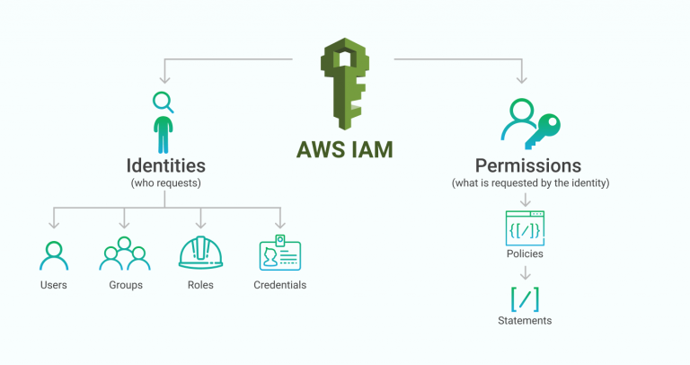

실습
===
[워크샵 카탈로그](https://catalog.workshops.aws/general-immersionday/ko-KR)  

구성하려는 아키텍처

(1) VPC 생성하기
--------------
vpc 마법사로 간단하게 생성가능    

버지니아 리전   

가용영역(AZ) 2개  
> 각 AWS 리전에는 독립적으로 운여되도록 설계된 여러 개의 가용 영역이 있습니다. 가용 영역은 나고리, 토네이도, 지진 등 발생 가능한 문제로 인한 연쇄적 영향으로부터 보호하기 위해 물리적으로 유의미한 거리를 두고 설치 됩니다. 고가용성을 위해 최소 2개 이상의 AZ를 사용하는 것이 좋습니다.

public 서브넷 2, private 서브넷 2로 구성

`public` : **Internet Gateway**를 통해서 외부 인터넷과 트래픽을 주고 받는다.  
`private` : internal 통신을 주로 하는데, 외부와의 통신이 필요할 때는 public 서브넷에 위치한 **NAT gateway**를 통해서 트래픽을 주고 받는다.   
(NAT gateway 요금이 비싼데.. 고가용성을 고려해서 AZ당 1개씩 배치할건지, 그냥 전체 vpc에 1개만 배치할것인지 결정하도록 한다.)

**vpc 엔드포인트**  
vpc랑 s3 (region level에 위치하는 리소스라 vpc 바깥에 존재한다.)가 통신해야 할 때, 어차피 aws 내부의 트래픽인데 굳이 외부 인터넷을 통할 것 없이, vpc 엔드포인트를 통해 연결해서 NAT gateway 요금 줄이고, 보안 강화하기 위한 용도

vpc 마법사로 vpc 생성한 구조

(2) 임시 EC2 인스턴스로 AMI 이미지 생성하기
-------------------------------
1. public 서브넷에 AMI 이미지 만들기용 임시 EC2 인스턴스를 생성한다.
- 이때 이 EC2 인스턴스에 부여할 **Security Group (네트워크 방화벽 역할)**을 하나 생성한다. `Immersion Day - Web Server : (모든 소스의 http request 허용)`
- 생성한 인스턴스의 public IP주소나 DNS를 입력해서 접근 가능한지 확인한다.
- 인스턴스 접속 
    - (1) pem key pair로 로컬 터미널에서 ssh 접속
    - (2) ec2 인스턴스 콘솔 > connect > 브라우저 기반 ssh 콘솔
    - (3) 세션 매니저

- EC2 인스턴스에 **IAM role** 부여하기 (세션 매니저 사용을 위해..)  
role : `SSMInstanceProfile`  [인가 / Identity🌵] : 누구인가?  
policy : `AmazonSSMManagedInstanceCore`  [인증 / Permission🌵] : 인증된 사용자/리소스가 서비스에 대한 권한 갖고 있는가? 

2. 이 EC2 Action으로 AMI 생성하기

3. AMI가 잘 생성되었다면 EC2는 terminate해도 좋음.

인스턴스에 부여된 public ip는 stop (EBS 볼륨만 남고 나머지 날아감), terminate 시에 모두 수거됨.

(3) 로드밸런서 생성하기
------------------
1. ALB 생성하기
- private 서브넷에 위치하도록 생성해야 한다.
- 로드밸런서를 위한 새로운 **Security Group** 생성 `web-ALB-SG : (모든 소스의 http request 허용)`
- listener 설정 : 설정한 포트로 ec2 인스턴스에 로드밸런서가 **헬스체크** 보낸다. 3번정도 ping에 응답이 없으면 후속 처리를 한다 (해당 인스턴스로 트래픽 보내지 않기, 오토스케일링 그룹 지정이 되어있다면 죽이고 새로 띄우기 등..)
- routing 설정 : 트래픽을 보낼 **타겟그룹** 설정한다. (마치 k8s 서비스 엔드포인트에 pod label 연결하듯이) 추후에 오토스케일링 그룹이랑 로드밸런서 타겟그룹 연결

(4) 오토 스케일링 그룹 생성하기
------------------------
로드 밸런서 뒤에 인스턴스 배치하기 과정

1. **시작 템플릿** 구성하기.  (template launch)  
인스턴스 생성에 필요한 모든 시작 파라미터가 설정되어 있어서 (AMI 및 인스턴스 유형 등..) 오토 스케일링 그룹이 이 정보에 따라 새로운 인스턴스를 추가함.
- ALB 뒷단 EC2에 부여할 SG 생성하기 `ASG-Web-Inst-SG : (ALB SG에서 오는 http 트래픽만 허용할 것)`
- 시작 템플릿 생성하기. AMI, 인스턴스 타입 (t2.micro), SG, IAM role 부여 등의 설정을 여기서 한다.

2. **AutoScaling Group** 구성하기.
- 런치 템플릿 지정하고, private 서브넷에 인스턴스 생성되도록 설정, 위에서 만든 로드밸런서의 타겟그룹에 부착, scaling policy 지정등의 작업을 한다.

3. 로드밸런서 DNS로 접속이 잘되는지 확인하고, 부하테스트 진행해서 인스턴스 개수가 잘 오토스케일링 되는지 확인한다.
(cloudWatch 메트릭이랑 연동되서 스케일 인, 아웃 됨)

(5) RDS 생성하기
--------------
1. DB에 부여할 SG 생성하기. DB도 내부적으로 인스턴스로 구동되는 서비스라 보안 그룹 적용이 필요하다. `DB-5G : (ec2 SG에서 오는 http 트래픽만 허용)`

2. Aurora 인스턴스 생성하기

3. 데이터 연결정보를 저장하기 위한 Secret 생성하기 (**Secret Manager**)
크레덴셜 정보. 그리고 ec2 인스턴스가 이 시크릿에 접근할 수 있드록 ec2인스턴스에 부여한 `SSMInstancePolicy` role에 시크릿 매니저 read policy도 추가해준다. (내부 코드에서 이 정보 통해서 웹앱 - db 연결)

4. Writer가 Failover처리 되면 즉시 Read중 하나가 Writer가 된다. 따라서 db 인스턴스 사이즈 키우거나 할 때 Read를 먼저 키우고, Writer failover 시켜서 Writer로 승격시키는 방식으로 처리하는게 훨 빠르다.

