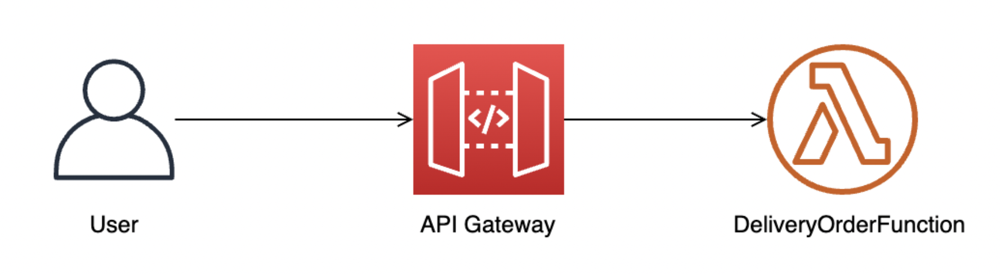
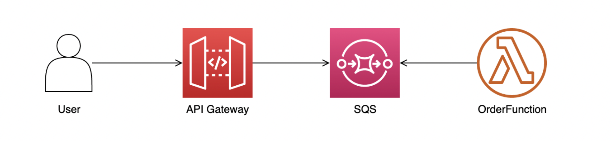
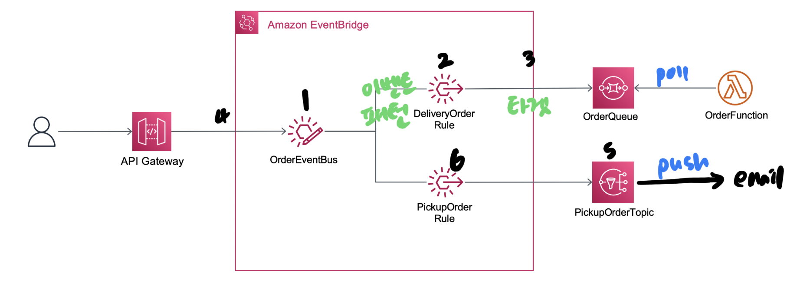

serverless 배달 주문 서비스 만들기 실습
================================
[워크샵 카탈로그](https://catalog.us-east-1.prod.workshops.aws/workshops/4923c0ff-6470-46e1-9884-7c6ee63e7136/ko-KR)  

#### 1) 가장 심플한 형태의 배달 주문 api
- API gateway랑 람다함수로만 구성한다.
- `동기적`으로 요청 처리하는 가장 기본적인 구조.



(1) API gateway 생성하기  
(2) API gateway에 `POST /order` route 생성   
-> 여기에 인증, 백엔드 리소스 연결할 수 있다.  

(3) 람다 함수 작성 (주문 요청 처리하는 코드)  
(4) API gateway에 람다함수 연결  
(5) API gateway url로 curl command 보내보고 람다함수가 잘 작동하는지 확인한다.  
-> cloudwatch 로그 그룹에 로그가 남아있어야 한다.


#### 2) SQS를 사용하여 `비동기 처리` 모델로 변경하기
- 많은 트래픽을 안정적으로 처리하기 위해 선택할 수 있는 옵션 중 하나.
- 많은 요청을 queue에 저장하고, 뒷단에서 polling 해다가 처리하는 방식.



(1) SQS 주문 큐 생성하기  
(2) api gateway `POST /order`에 기존에 연결했던 lambda 삭제하고 (integration) (1)에서 생성한 SQS를 새롭게 연결한다.  
통합 연결시 설정
- message body => request body message
- invocation role => SQS 쓰기 권한 필요  

(3) lambda와 SQS 연결. 
- trigger 기존의 API gateway 삭제하고, SQS로 지정한다.  
- SQS에서 읽어오는 권한이 필요하므로, 람다가 가진 role에 SQS Execution policy를 추가해준다.

(4) curl command 보내보고 로그 제대로 남는지 확인.

(5) DLQ 적용하기. dead-letter-queue  
정해진 retry 횟수를 초과해 실패하는 경우, 메세지를 dead-letter-queue에 넣도록 설정한다. (나중에 꺼내서 후속 처리할 수 있도록)
- SQS로 OrderDLQ 생성. 
- (1)에서 만든 큐의 DLQ를 여기서 만든 큐로 지정하도록 편집.


#### 3) EventBridge 적용하기
- API gateway로 들어오는 메세지 종류에 따라 `메세지 라우팅 처리`하기.
- 주문타입 (배달, 포장)에 따라 다른 처리 흐름을 정의한다. 
- SNS도 도입해본다. 


> Amazon EventBridge는 이벤트 기반 애플리케이션을 대규모로 손쉽게 구축할 수 있는 서버리스 Event Bus입니다. EventBridge 를 사용하면 **데이터를 전송할 대상을 결정하는 `라우팅 규칙`을 설정**하여 이벤트 게시자와 소비자가 완전히 분리된 데이터 원본에 실시간으로 대응하는 애플리케이션 아키텍처를 구축할 수 있습니다.


(1) Event Bus 생성하기  
(2) `배달 타입` 메세지를 대응하는 event rule `DeliveryOrderRule` 생성하기
- 타겟1 : awscloudwatch 로그그룹

**룰타입**  
- event pattern
- schedule (=> cron으로 주기적으로 event trigger)  
두가지 중에 선택할 수 있다.

이벤트 패턴 예시   
[event pattern doc](https://docs.aws.amazon.com/eventbridge/latest/userguide/eb-event-patterns.html)
```
{
  "source": ["com.mycompany.order"],
  "detail": {
    "orderType": ["order-delivery"]
  }
}
```

(3) 주문 rule에 타겟2로 SQS 연겷해서 람다가 주문 처리하게 하기.

(4) api gateway와 eventbridge 연결하기
- 위에서 api gateway와 SQS를 바로 연결했던 것을 끊는다.
- 새로운 통합설정으로 eventbridge 연결하기

(5) `픽업 타입` 메세지 처리를 위한 SNS 생성하기.  
픽업 메세지는 이메일 전송으로 대응하기로 한다. (pub/sub)
- SNS 토픽 생성.
- 토픽 구독 설정 Email

(6) `배달 타입` 메세지를 대응하는 event rule `PickupOrderRule` 생성해서, SNS를 Eventbridge와 연결한다.

- 이벤트 패턴
```
{
  "source": ["com.mycompany.order"],
  "detail": {
    "orderType": ["order-pickup"]
  }
}
```
- 타겟1 : SNS 토픽


