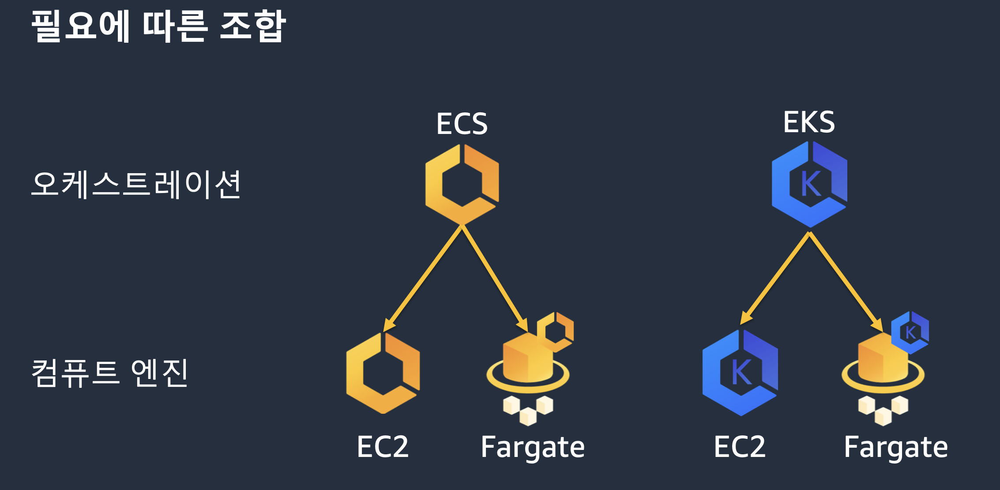
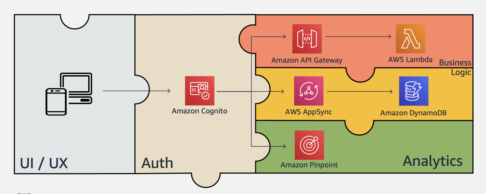
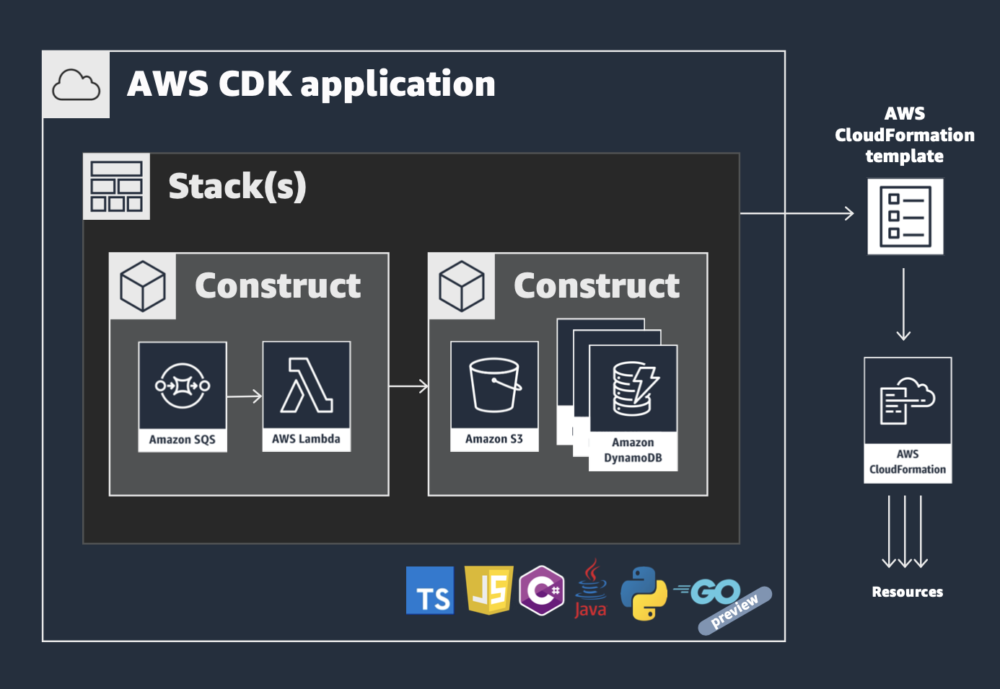

DAY3
====

container
---------
control plane -> eks, ecs  
data plane -> ec2, fargate(serverless)

서비스 메쉬 -> cloudmapp, app mesh

  

`eks` -> aws 관리형으로 제공하는 쿠버네티스. 워커노드만 관리하면 되도록 만들어준다  
`ecs` -> 러닝커브가 있는 쿠버네티스 대신 간단하게 컨테이너로 서비스 운영하고 싶을 때. 비용 부담 절감
- ecs 클러스터
- ecs task = pod와 유사. ec2에 iam role binding하는 것처럼 ecs에서는 태스크에 바인딩한다.
- ecs service = deployment + service와 유사
- ecs agent = kublet과 유사
- firelens -> 로깅 관련 모니터링 이미지. fluentd 같음

`fargate` -> 서버리스 컴퓨팅 엔진. 아직 gpu 지원이 안되고, cpu, 메모리 조합이 한정적인 단점이 있음.

하나의 클러스터에 ec2, fargate 하이브리드형으로 조합 가능하다.


[container 실습](container.md)


observability
-------------
#### observability 도구
- cloudwatch logs  
  cloudwatch synthetics -> 엔드포인트 서비스가 잘 되고 있는지, url 통해서 헬스체크하고 에러 났을때 스크린샷 저장.
- cloudwatch metrics
- x-ray traces : end-to-end 요청 흐름에 대한 가시성 제공. 어디가 병목인지 살펴본다.  
- servicelens : 모든 insight 한꺼번에 보기  
[observability 실습](https://catalog.workshops.aws/observability/ko-KR)

amplify
-------
GCP `firebase` 처럼 웹, 모바일 개발자 타겟으로 간단하게 풀 스택 app을 구축하고 배포할 수 있도록 해주는 도구 모음.  
[Firebase vs AWS Amplify](https://www.youtube.com/watch?v=ucmbO2lWC2A)  



- 빠른시간에 prototype 개발을 하고 싶을 때 사용하면 좋다.
- 서버리스라 실행 시간만큼만 과금된다.

#### cognito
서버리스 인증 서비스
`user pool` -> 유저 관리. 회원가입, 로그인, 로그아웃  
`identity pool` -> aws 리소스 접근을 위한 임시 자격 증명. aws 서비스 액세스 제어.
```
amplify add auth
```

#### Appsync
graphql 서비스. 단일 엔드포인트로 데이터에 대한 CRUD
```
amplify add api
```

#### pinpoint
프로모션 이메일, 푸시 알림 등 마케팅을 위한 다양한 채널을 제공하는 서비스인데, amplify에서는 분석을 위해 사용한다.
```
amplify add analytics
```


CDK
---
IaC (Infrastructure as Code)  
인프라를 코드로 관리하기.

[cdk 실습](cdk.md)

### aws 리소스 생성하는 방법
1. 웹 콘솔
- 가장 쉽고, 편리하다.
- 하지만 비슷한 리소스를 반복해서 배포하고, 수정해야 할 경우 비생산적이고, 휴먼에러가 발생할 가능성이 높다.

2. script
- 웹 콘솔보다 자동화할 수 있는 방법.
- aws에서 제공하는 api로 리소스를 생성, 삭제, 변경하기 (sdk)
- 하지만 이것도 리소스 변경이 필요할 때마다 자주 코드를 수정해줘야 한다.
- `declarative` x `imperative` o 중간에 에러 발생했을 때 처리가 어렵다.

3. provisioning engine
- `Ansible playbook`, `Terraform hashicorp`, `AWS cloudformation` 같은 것들이 있다.
- `declarative` 하게 원하는 프로비저닝 된 모습을 정의하면 그대로 만들어 준다.
- 그러나 config할게 많고 사용하기에 learning curve가 높다.

4. CDK
- (3)번 방식의 CloudFormation을 쉽게 사용할 수 있도록 추상화된 프레임워크 도구
- 친숙한 프로그래밍 언어를 사용해서 app 개발하듯이 인프라를 생성, 관리
- 리소스 정의를 컴포넌트화, 재사용 가능.

### CDK 3가지 구성 요소


1. core framework -> app, stack, resources

app은 다수의 stack으로 구성되어 있고, stack안에 construct로 각종 aws 서비스 정의한다.

`construct` => 가장 기본적인 building block  
level1 : 가장 저수준. cfn이라는 prefix가 붙은 경우. 이것을 사용하게 되는 경우는 자주 있진 않을 것이다.  
level2 : 좀더 고수준. 각종 메소드가 정의되어 있어서 필수적인 값들만 오버라이드하여 사용한다.  
level3 : aws 서비스들로 구성된 패턴. 예) `ecs_pattern.ApplicationLoadBalancedFargateService`

[cdk reference 문서 참고하기](https://docs.aws.amazon.com/cdk/api/v2/)  
[aws 솔루션 구문 패턴](ucts-master-cards.sort-by=item.additionalFields.headline&constructs-master-cards.sort-order=asc&awsf.constructs-master-filter-tech-categories=*all&awsf.constructs-master-filter-products=*all)  

2. construct library -> aws 서비스를 다루기 위한 컴포넌트 클래스
3. cdk cli -> cli 명령어로 빌드, cloudformation stack 합성, 배포


### 작동방식
1. cdk app 작성
2. 빌드하기 (예를들면 ts -> js)
3. cdk synth : cloudformation template stack으로 변환
4. cdk deploy : 배포. aws에 리소스 프로비저닝 됨.
