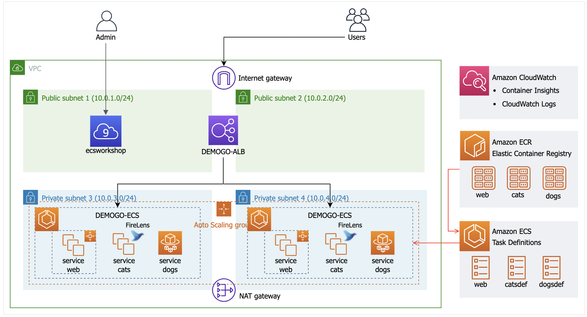

ECS 실습
=======
[실습 카탈로그](https://catalog.us-east-1.prod.workshops.aws/workshops/8c9036a7-7564-434c-b558-3588754e21f5/ko-KR)  

구성할 아키텍처

app launch type을 web, cats -> `ec2`, dogs -> `fargate`로 구성한다.

1) cloudformation 스택 배포로 가장 기본적으로 필요한 vpc, SG, IAM 리소스등을 생성한다.

2) ECR에 컨테이너 이미지 생성하고 푸시하기
- ecr 리포지토리 생성
- 도커 이미지 빌드
- ecr로 푸시

3) ECS 클러스터 생성하기

4) ECS 태스크 정의하기   
`task` -> k8s pod 와 유사.   
다음과 같은 것들을 정의한다
- 컨테이너 도커 이미지
- cpu, 메모리 양
- ec2? fargate?
- 컨테이너 네트워킹 모드
- 로깅 구성

web, catsdef, dogsdef 태스크들을 모두 정의해주면 된다.   
JSON 템플릿으로 구성하거나, 웹 콘솔에서 하나씩 설정해줘도 된다.  

catsdef 같은 경우에는 1) cat app 이미지 컨테이너, 2) 로그를 위한 `firelens` (aws 관리형 fluentd) 컨테이너 두가지를 추가하도록 한다. 사이드카 패턴.

### 컨테이너 네트워크 모드
[network mode](https://docs.aws.amazon.com/AmazonECS/latest/bestpracticesguide/networking-networkmode.html)  
- `host mode`   
- `bridge mode` (default)  
하나의 eni에 여러개의 컨테이너가 매핑되어 (dynamic 매핑) host모드와 다르게 하나의 ec2에 여러개의 컨테이너를 띄울 수 있다. 일반적인 도커 브릿지 모드와 동일하다.
- `awsvpc mode`  
launch type이 fargate일 경우에는 이 모드만 지원한다. 각 컨테이너마다 eni를 만들어주고 이것과 컨테이너를 1:1 매핑.   
장점 : eni별로 SG를 다르게 줄 수 있어서 보안에 좋다. 서비스 디스커버리가 쉽기 때문에 관리하기 좋다.  
고려할 점 : 컨테이너 별로 eni를 가지면, 컨테이너 개수만큼 ip 필요. private subnet 크기만큼 사용할 수 있는 ip 개수 제한되어 있어서, 서브넷이 작으면 ip 부족 문제 고려해야한다.

5) ECS 서비스 만들기  
`service` -> k8s deployment + service와 유사. 
- 어떤 태스크를 몇개 띄울지 => deployment 역할
- loadbalancing 정의 (alb에서오는 특정 path 요청을 타겟 태스크로 로드밸런싱) => service 역할

eks가 k8s랑 완전 호환된다면, ecs 좀더 추상화 시키고, object 개수도 적은 느낌이다.

---
추가 실습 추천   
app mesh  
service discovery  

